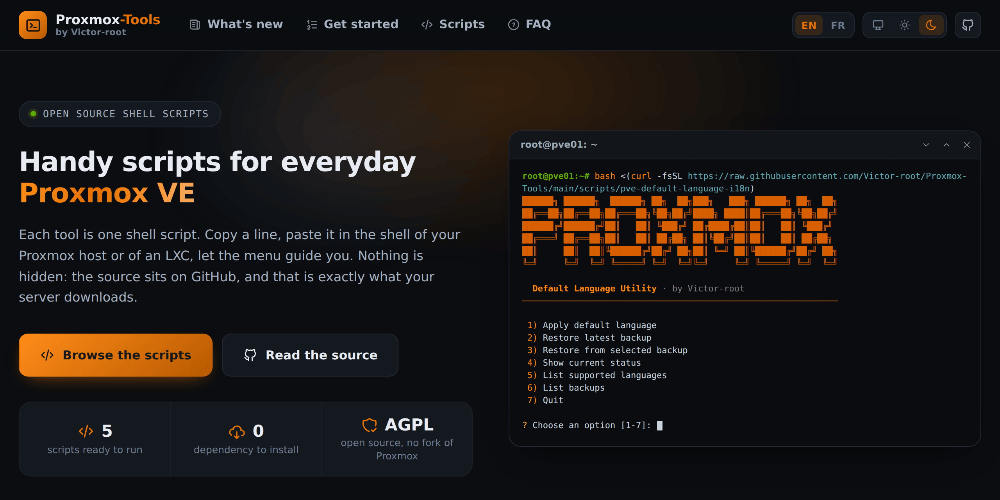

<div align="center">

<h1>🚀 Proxmox-Tools</h1>

<p>
  <b>A growing hub of useful shell scripts for Proxmox VE.</b><br>
  Fast to run. Easy to reuse. Built for real-world homelab and admin workflows.
</p>

<p>
  <a href="https://victor-root.github.io/Proxmox-Tools/"></a>
</p>

<p>
  <a href="https://victor-root.github.io/Proxmox-Tools/"></a>
  <a href="https://victor-root.github.io/Proxmox-Tools/"></a>
  <a href="https://github.com/Victor-root/Proxmox-Tools/tree/main/scripts"></a>
</p>

<p>
  <a href="https://github.com/Victor-root/Proxmox-Tools/tree/main/scripts"></a>
  <a href="https://github.com/Victor-root/Proxmox-Tools/commits/main"></a>
  <a href="LICENSE"></a>
</p>

<a href="https://victor-root.github.io/Proxmox-Tools/">
  <picture>
    <source media="(prefers-color-scheme: dark)" srcset=".github/assets/website-dark.png">
    <source media="(prefers-color-scheme: light)" srcset=".github/assets/website-light.png">
    
  </picture>
</a>

<p>
  <b><a href="https://victor-root.github.io/Proxmox-Tools/">victor-root.github.io/Proxmox-Tools</a></b><br>
  Every script with what it does, what it writes on your machine, the line to run it
  and a preview of its menu.<br>
  In English and French, light and dark. Same files as this repository, nothing else.
</p>

</div>

---

## ✨ What is this repository?

**Proxmox-Tools** is a central place for small, practical, focused scripts made to improve day-to-day life on **Proxmox VE**.

The goal is simple:

* 🧰 keep each tool **independent**
* ⚡ make scripts runnable in **one command**
* 🔎 keep behavior **clear and predictable**
* 💾 always prefer **safe changes with backup/restore when possible**
* 📦 build a reusable **toolbox / hub** instead of one giant script

This repository is meant to grow over time with more Proxmox-oriented utilities.

---

## 🛠️ Available scripts

Click a script to unfold what it does, what it supports and the line to run it.

<details>
<summary><b>🖱️ Open Proxmox consoles in new tabs</b></summary>

**Script:** `pve-console-newtab.sh`

Adds a more convenient browser workflow for the Proxmox VE web interface:

* 🖱️ **Middle click** on the main **Console** button opens the default web console in a **new tab**
* 🖱️ **Middle click** on **noVNC** opens it in a **new tab**
* 🖱️ **Middle click** on **xterm.js** opens it in a **new tab**
* 🖱️ **Middle click** on **SPICE** behaves like a normal click, without opening a useless browser tab
* 💾 automatic **backup** before patching
* ♻️ built-in **restore** options
* 📋 interactive menu

#### Version compatibility

Checked against the official Proxmox VE sources:

| Proxmox VE | Status |
| --- | --- |
| **9.x** (`pve-manager` 9.0.0 to 9.2.11) | ✅ supported |
| **8.4.2 and newer** (with `proxmox-widget-toolkit` 4.3.12+) | ✅ supported |
| **8.4.1 and older** (8.0, 8.1, 8.2, 8.3) | ❌ not supported |

Proxmox re-formatted its JavaScript sources in June 2025, so the code blocks this patch targets only match releases published after that change.

On an unsupported release the script stops with a clear message, creates no backup and leaves both files untouched, so nothing can break.

Each of the two patched files is also checked and patched on its own: a Proxmox update that refreshes only one of the two packages can simply be re-patched.

#### Run it directly

```bash
bash <(curl -fsSL https://raw.githubusercontent.com/Victor-root/Proxmox-Tools/main/scripts/pve-console-newtab.sh)
```

</details>

<details>
<summary><b>🔕 Remove the subscription notice</b></summary>

**Script:** `pve-remove-subscription-notice.sh`

Removes the **"No valid subscription"** popup from the Proxmox VE web interface:

* 🔕 no more popup at every login
* 🧩 the buttons that depend on that check keep working (package versions, system report, APT refresh, add repository)
* 📱 separate option for the **mobile interface** of **Proxmox VE 9**, which is another application entirely and needs its own patch
* 🔁 optional **automatic re-apply** after a package update, through an APT hook
* 💾 automatic **backup** before patching
* ♻️ built-in **restore** options
* 📋 interactive menu

> ℹ️ Proxmox VE stays free software either way, but a subscription funds its development and gives access to the enterprise repository.

> ⏳ The final `pveproxy` restart can take up to a minute, and the web interface stays unreachable meanwhile. See [About the pveproxy restart](#-about-the-pveproxy-restart).

#### Version compatibility

Checked against the official Proxmox VE sources: the patch applies from **proxmox-widget-toolkit 4.0.9 to 5.2.8**, which covers Proxmox VE **8.0 through 9.2**.

The widely shared one-liner for this comments out the popup itself, which also silently kills every button that waits for it. This script instead lets the requested action run straight away, so nothing else changes. On an unsupported release it stops with a clear message, creates no backup and leaves the file untouched.

#### About the mobile interface

**Proxmox VE 9 only.** The mobile interface of Proxmox VE 9 is a separate application compiled to WebAssembly, so the JavaScript patch above never reaches it and its popup keeps showing on a phone. Proxmox VE 8 ships a different, older mobile interface that this patch does not touch, so on 8 the script refuses the option instead of changing a file for nothing. It nags when the node list comes back without a support level, and that level is filled by one line of Perl in `PVE/API2Tools.pm`, which is what option 8 patches, with its own backup and its own way back.

That patch is offered separately because it is not the same kind of change: it modifies what the API answers about the support level of the nodes, so a monitoring tool reading that list will see `community`. The per node subscription endpoint is left alone, the Subscription panel keeps reporting that there is no subscription, and nothing is unlocked: the enterprise repository still needs a real key. The script spells all of this out and asks for confirmation before touching anything.

#### Run it directly

```bash
bash <(curl -fsSL https://raw.githubusercontent.com/Victor-root/Proxmox-Tools/main/scripts/pve-remove-subscription-notice.sh)
```

</details>

<details>
<summary><b>🌍 Proxmox VE default language manager</b></summary>

**Script:** `pve-default-language-i18n`

Changes the default **Proxmox VE language** for both the shell and the web interface:

* 🌍 set the default **system locale**
* 🖥️ set the default **Proxmox VE web UI language**
* 📱 optional, **Proxmox VE 9 only**: apply that same default to its **mobile interface**, which otherwise always starts in English
* 🧠 auto-detect the server language for the script interface
* 🇬🇧 fallback to **English** if the detected language is unsupported
* 🕒 optionally configure timezone and NTP
* 💾 automatic **backup** before changes
* ♻️ built-in **restore** options
* 📋 interactive menu

> ⚠️ Keep an active **root SSH session** open while running this script, in case the Proxmox VE web interface does not restart correctly.

#### Version compatibility

Checked against the official Proxmox VE sources: the system locale mechanism and the `language` key of `/etc/pve/datacenter.cfg` are identical from **8.x to 9.2**, so this script behaves the same on both.

Proxmox VE only accepts a fixed list of languages for its web interface. For a language it does not offer (Galician, Hungarian), the system locale is still applied and `datacenter.cfg` is left untouched, with a clear warning, instead of writing a value Proxmox would silently drop.

#### About the mobile interface

**Proxmox VE 9 only.** The mobile interface of Proxmox VE 9 is a separate application, and it does not read the language of `datacenter.cfg`. Proxmox VE 8 ships a different, older mobile interface, so on 8 the option reports that this interface is not installed and changes nothing. It keeps its own language in the browser storage, so it starts in English on every new device and in every private window, until someone picks a language in its settings.

Option 7 adds a few lines to its page so a browser that never chose a language starts with the one from `datacenter.cfg`. A choice made in the mobile settings still wins, and option 8 removes those lines. The page belongs to Proxmox VE, so an update of the mobile interface package drops them and the option simply puts them back.

#### Run it directly

```bash
bash <(curl -fsSL https://raw.githubusercontent.com/Victor-root/Proxmox-Tools/main/scripts/pve-default-language-i18n)
```

</details>

<details>
<summary><b>🔐 WireGuard VPN server installer & client manager (LXC)</b></summary>

**Script:** `lxc-wireguard-server-install.sh`

Installs and manages a native **WireGuard VPN server** inside a Debian/Ubuntu **LXC** on Proxmox (no Docker), through an interactive menu:

* 🧭 guided install with **3 clear network modes**: private network, LAN access, full Internet tunnel
* 👤 full client lifecycle: **add**, **list** (with live connection state), **show / re-scan** (config + QR code), **revoke**
* 🩺 **diagnostic** that checks the service, UDP port, IPv4 routing, firewall rules and connected clients, in plain language
* 🌐 endpoint by **public IP or domain**, with a **CGNAT** warning and a check that the domain points to the server
* 🧱 automatic **nftables** rules and IPv4 forwarding for LAN / full-tunnel modes
* 🔧 per-client tunables: AllowedIPs, DNS, PersistentKeepalive, **MTU** (default 1420)
* 🧠 remembers your settings (endpoint, port, network) after the first run
* 🌍 interface in **English or French**, following the system locale, English by default
* 💾 built-in **backup / restore** of the whole configuration
* 🧹 clean **uninstall**
* 📋 interactive menu

#### Run it directly

```bash
bash <(curl -fsSL https://raw.githubusercontent.com/Victor-root/Proxmox-Tools/main/scripts/lxc-wireguard-server-install.sh)
```

> ⚠️ Run it as **root inside the target LXC** (not on the Proxmox host). On an **unprivileged** container, WireGuard needs `/dev/net/tun` passed through: the script detects this and shows the exact `pct set` commands to run on the host if needed.

</details>

<details>
<summary><b>🖥️ Fastfetch summary on every root shell</b></summary>

**Script:** `pve-fastfetch-motd.sh`

Installs **Fastfetch** and turns it into a clean Proxmox summary displayed every time a root shell opens:

* 📦 installs the **latest stable Fastfetch release** from GitHub, with automatic **architecture detection** (amd64, arm64, armhf, ppc64el, riscv64, s390x)
* 🎨 writes a ready-to-use Proxmox themed configuration, split in three blocks: hypervisor info, physical resources, network and access
* 📊 live values: PVE version, CPU temperature and usage, RAM, swap, storage, ZFS pool health, bridge state, local and public IP, DNS, Fail2ban jails
* 🔐 optional **HTTPS certificate check** on a FQDN you provide, which reads only the public certificate presented by your reverse proxy, never a private key
* 🐚 displayed only in **interactive root shells**, never during scripts, file transfers or automation
* 🧹 disables the old Debian MOTD, with the original state saved for a later restore
* ♻️ two removal levels: stop the display at every shell session and keep Fastfetch, or remove everything and uninstall the package
* 💾 automatic **backup** of an existing Fastfetch configuration before writing
* 🌍 interface and generated labels in English or French, following the server locale
* 📋 interactive menu

#### Version compatibility

The script only relies on `pveversion`, `apt` and the official Fastfetch packages, so it behaves the same on Proxmox VE **8.x and 9.x**.

It stops with a clear message when it is not run as root on a Proxmox VE host, and running it again is safe: an up-to-date Fastfetch is not downloaded twice, and the login hook and MOTD changes are simply re-applied.

The bridge shown in the network block is detected from the default route, with `vmbr0` as fallback, and no domain, IP or hostname is ever hard coded in the script.

#### Run it directly

```bash
bash <(curl -fsSL https://raw.githubusercontent.com/Victor-root/Proxmox-Tools/main/scripts/pve-fastfetch-motd.sh)
```

> ℹ️ Open a new root shell after the installation to see the result.

</details>
---

## 📂 Repository philosophy

Each script lives as its **own file** inside the `scripts/` directory.

That means:

* you can call **one specific script** directly
* you do **not** need a global installer for everything
* each tool can evolve independently
* sharing a tool is easy with a targeted raw GitHub URL

Example layout:

```text
scripts/
├── pve-console-newtab.sh
├── pve-default-language-i18n
├── future-tool-1.sh
├── future-tool-2.sh
└── ...
```

---

## 🔒 Safety notes

Some tools in this repository may modify Proxmox files or behavior.

Before using any script:

* read what it does
* keep an active **root SSH session** open
* make sure you understand the rollback path
* prefer testing on a non-critical node first

When relevant, scripts in this repository should:

* create backups before changes
* fail safely if expected patterns are not found
* avoid destructive behavior by default

### ⏳ About the pveproxy restart

Every script that changes the web interface restarts `pveproxy` at the end. That restart can take up to a minute: on start Proxmox refreshes the cluster certificates (`pvecm updatecerts`), and on a first run it may also refresh the appliance template list.

The web interface stays unreachable during that time, and the script looks frozen while it waits. This is expected. Let it finish rather than interrupting it, and reload the page with **Ctrl+Shift+R** once it is done.

---

## 🎯 Project goals

This repo is intended to become a practical **Proxmox utility hub**, for example:

* UI enhancements
* backup helpers
* audit / health-check scripts
* storage / ZFS helpers
* cluster helpers
* networking helpers
* quick-fix admin tools

The main idea is not to build a huge framework.

The idea is to keep things:

* simple
* useful
* modular
* easy to launch

---

## 🤝 Contributing

Ideas, fixes, and improvements are welcome.

Good contributions are usually:

* focused on one real problem
* easy to understand
* safe to test
* easy to remove or rollback

---

## 📄 License

This repository is published under the **GNU Affero General Public License v3.0**.
The full text is in [LICENSE](LICENSE).

You can use, study, change and share these scripts, as long as what you share
stays under the same license and keeps the credit.

---

## 📜 Disclaimer

These scripts are provided as-is.

Use them carefully, review them before running them, and test them in your own environment.

---

## ⭐ Why this repo exists

Because Proxmox is great, but there are always a few small things that can be made faster, cleaner, or less annoying with the right script.

This repository exists to collect those improvements in one place.
